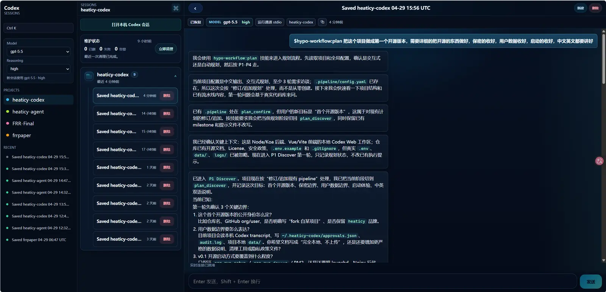
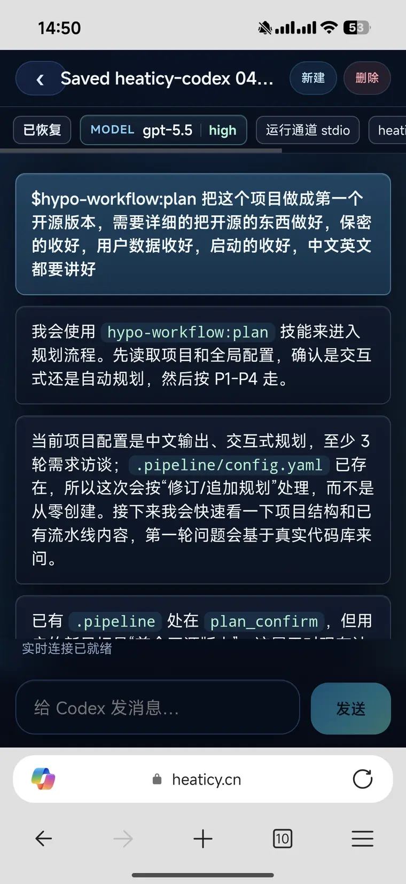

# Heaticy-Codex

English | [简体中文](./README.zh-CN.md)

Use your local `codex` sessions from a browser, including a phone on the same LAN.

Heaticy-Codex is a heaticy-maintained fork of [codex-cc-web-terminal](https://github.com/SZZH/codex-cc-web-terminal). This repository focuses on a local-first Codex workspace that is easy to run on a computer and open from a mobile browser over Wi-Fi.

The app runs on your own machine. It does not upload your prompts, transcripts, approvals, audit logs, or project data to a Heaticy-Codex service.

## Preview

<p align="center">
  
</p>

## Requirements

- Node.js 22+
- `codex` CLI installed and available in `PATH`

## Quick Start

```bash
git clone https://github.com/SZZH/heaticy-codex.git
cd heaticy-codex
npm run setup
```

`npm run setup` checks your environment, writes `.env`, validates that `PORT` and `WEB_PORT` are not occupied, installs dependencies if you choose, and can start the dev service.

Manual setup:

```bash
cp .env.example .env
# Edit ACCESS_TOKEN, PORT, WEB_PORT, and HOST if needed.
npm install
npm run dev:up
```

Open on the computer:

- Frontend: `http://127.0.0.1:<WEB_PORT>/#/sessions`
- Backend health: `http://127.0.0.1:<PORT>/api/health`

## Mobile LAN Access

<p align="center">
  
</p>

1. Keep `HOST=0.0.0.0` in `.env`.
2. Set your own `WEB_PORT`, for example `WEB_PORT=5206`.
3. Start the app with `npm run dev:up` or `npm run service:start`.
4. On a phone connected to the same Wi-Fi, open `http://<LAN-IP>:<WEB_PORT>/#/sessions`.
5. Sign in with `ACCESS_TOKEN`.

`PORT` is the backend API port. `WEB_PORT` is the browser entry point. Both are configurable, and setup/start scripts check for occupied ports before using them.

## Common Commands

```bash
npm run setup          # Guided setup with port checks
npm run dev            # Foreground dev mode
npm run dev:up         # macOS/Linux background dev mode
npm run dev:down       # Stop background dev processes
npm run service:start  # PM2 production-style service
npm run service:status # PM2 status and health check
npm run check          # Syntax checks and frontend build
npm test               # Backend/unit tests
```

## Skill Completion

In the chat composer, type `$` plus a prefix to pick an installed Codex skill. The list is loaded from `CODEX_HOME` or `~/.codex`, shows up to five touch-friendly options above the composer on mobile, and inserts canonical names such as `$hypo-workflow:plan`. Unique aliases such as `$hw:plan` are normalized before sending; ambiguous aliases are left unchanged.

## Local Data And Privacy

Heaticy-Codex is local-first:

- It reads Codex session transcripts from your local Codex home.
- It stores Heaticy-Codex state locally in `data/` and `~/.heaticy-codex/`.
- Persistent approval rules live in `~/.heaticy-codex/approvals.json`.
- Audit records are appended to `~/.heaticy-codex/audit.log`.
- `.env`, `data/`, `logs/`, `.codex`, `.plan-state`, and `web/dist/` are ignored by git.

See [PRIVACY.md](./PRIVACY.md) for the full data boundary.

## Security Notes

- Set a strong `ACCESS_TOKEN`.
- Use `HOST=0.0.0.0` only on a network you control.
- Do not expose the app directly to the public internet without your own HTTPS, authentication, and network controls.
- `GET /api/health` is public for probes. `/api/healthz` and `/api/metrics` require login.
- High-risk Codex approval requests require manual confirmation.

See [SECURITY.md](./SECURITY.md) for reporting and deployment guidance.

## Optional Advanced Deployment

PM2/service mode:

```bash
npm run service:start
npm run service:status
npm run service:logs
```

Domain, HTTPS, and reverse-proxy deployments are optional advanced setups. Start from the local/LAN path first, then put your own proxy controls in front of the service if needed.

## Open Source

- Version: `1.0.0`
- License: [MIT](./LICENSE)
- Privacy: [PRIVACY.md](./PRIVACY.md)
- Security: [SECURITY.md](./SECURITY.md)
- Contributing: [CONTRIBUTING.md](./CONTRIBUTING.md)
- Code of Conduct: [CODE_OF_CONDUCT.md](./CODE_OF_CONDUCT.md)

This project is forked from [codex-cc-web-terminal](https://github.com/SZZH/codex-cc-web-terminal) and maintained as Heaticy-Codex.
